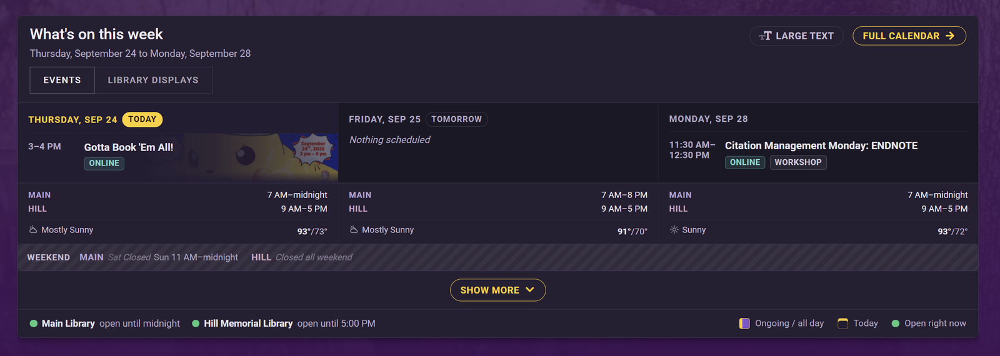

# LibCal Gantt Timeline


A Drupal block that shows upcoming Springshare **LibCal** events for the next
few weekdays, alongside building hours. Built for LSU Libraries.



## Features

- **Two display styles**, chosen per block placement:
  - **Homepage teaser** — compact day cards (today first), a weekend strip,
    Show more / Show less, and a Full calendar link.
  - **Full grid** — one row per location, one column per weekday. It switches
    to a day-by-day agenda on narrow screens.
- **Calendar tabs** — several LibCal calendars (e.g. Events and Library
  Displays) can each be a tab.
- **Multi-day events** are drawn once, spanning the days they cover.
- **Building hours** from LibCal Hours, with live "open now" status.
- **Weather** *(optional)* — a daily forecast from the National Weather
  Service on the homepage teaser's first three days.
- **Wikipedia "On this day"** *(optional)* — an empty homepage day gets a
  random anniversary from that date, with a link to the article. It's picked
  again on every page load.
- Dark, light or auto theme, a Large text toggle, and CSS custom properties
  for theming.
- LibCal credentials stay on the server. The browser only calls this site's
  own `/libcal-gantt/events` endpoint.

## Requirements

- Drupal 10.2+ or 11, PHP 8.1+
- LibCal API access, with an API application (client ID and secret) that can
  read Events

## Installation

Add the module to `web/modules/custom/libcal_gantt`, for example as a git
submodule:

```bash
git submodule add https://github.com/lsulibraries/libcal_gantt.git web/modules/custom/libcal_gantt
drush en libcal_gantt -y
drush cr
```

Or with Composer:

```bash
composer config repositories.lsulibraries-libcal-gantt vcs https://github.com/lsulibraries/libcal_gantt
composer require lsulibraries/libcal_gantt:dev-main
```

## Configuration

### Module settings

**Admin > Configuration > Web services > LibCal Gantt Timeline**
(`/admin/config/services/libcal-gantt`)

| Setting | What to enter |
| --- | --- |
| LibCal host, Client ID, Client secret | e.g. `https://lsu.libcal.com`, plus the credentials from LibCal Admin > API |
| Calendars | One `ID[,ID...]\|Tab label[\|no-hours]` per line, e.g. `8030\|Events` and `16219\|Library Displays\|no-hours`. `no-hours` hides building hours on that tab. |
| Number of weekdays to display, Timezone | Defaults: 10 weekdays, and the site's timezone |
| Location rows | One `campus ID\|Row label` per line, e.g. `261\|Main Library`. **Save this before setting up hours.** |
| Online events row label / keywords | The label for the online row, plus fallback keywords for spotting online events |
| Full calendar URL | Where the teaser's Full calendar button goes. A placement can override it. |
| Building hours *(optional)* | An Hours feed URL, plus an optional feed URL and location ID (`lid`) for each row |
| Daily weather *(optional)* | Turn it on and enter a latitude/longitude. The contact address defaults to the site email. |
| Wikipedia "On this day" *(optional)* | Tick **Show Wikipedia "On this day" facts on empty days** |
| Advanced | Max events per request, and the events cache lifetime |

### Placing the block

Place **LibCal Events Gantt Chart** under **Admin > Structure > Block layout**.
Each placement has these settings:

- **Display style** — Full grid or Homepage teaser
- **Heading**, **Days shown** (3 by default) and **Full calendar URL** —
  homepage teaser only
- **Show legend**, **Theme** (dark, light or auto), and **Show light/dark toggle
  to visitors** (full grid only)

## Upgrading

After updating the files, run:

```bash
drush updb
drush cr
```

## Customizing the look

Override the CSS custom properties on `.libcal-gantt-chart` in your theme:

```css
.libcal-gantt-chart {
  --libcal-gantt-bar-bg: #003057;
  --libcal-gantt-bar-color: #fff;
  --libcal-gantt-header-bg: #f4f4f4;
  --libcal-gantt-row-label-width: 180px;
}
```

You can also style these state classes: `now_open` / `now_closed`,
`past_date`, and `empty_weekend` / `event_weekend`. Only the **Workshop**
category tag is shown. To change that, edit `CATEGORY_ALLOWLIST` in
`js/gantt-timeline.js`.

## Troubleshooting

- **JS changes don't show up:** run `drush cr` and hard-refresh the browser.
- **No weather or "On this day" facts:** check that the setting is ticked,
  then look in **Reports > Recent log messages** for `libcal_gantt` errors.
  You can also open `/libcal-gantt/events?facts=1` and check
  `onThisDayStatus`.

## Security notes

- The client secret is stored in Drupal config. Don't commit a config export
  that contains it. For production, consider the
  [Key module](https://www.drupal.org/project/key).
- `/libcal-gantt/events` is public on purpose. It only returns event and hours
  data that LibCal already publishes.

## License

[GPL-2.0-or-later](LICENSE)
