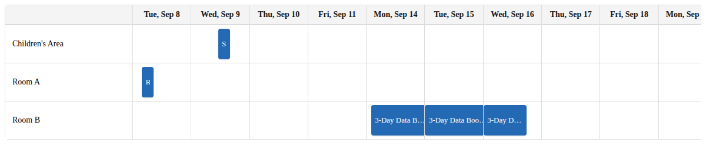
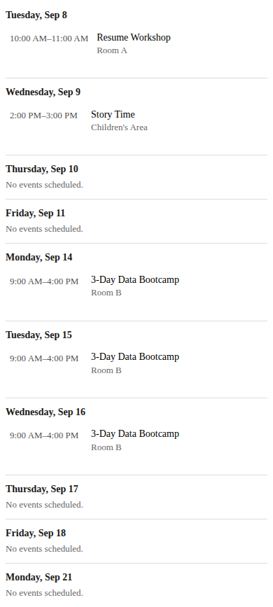

# LibCal Gantt Timeline


A custom Drupal module that pulls upcoming events from a Springshare **LibCal**
calendar and displays them as a Gantt-style timeline: one row per library
location (plus an online-events row), one column per weekday, with each day's
events stacked as full-width bars in start-time order. On phones it swaps
automatically to a vertical, day-by-day agenda. Built for LSU Libraries.

| Desktop / tablet (grid) | Phone (agenda) |
| --- | --- |
|  |  |

*(Screenshots use placeholder sample data.)*

## Features

- Pulls events from one or more LibCal calendars via the Events API,
  authenticated server-side with OAuth2 — no credentials or tokens ever reach
  the browser.
- Multiple calendars as switchable tabs above the chart, e.g. "Events" and
  "Library Displays". Switching keeps the current chart on screen under a
  spinner overlay until the new data arrives, so the block never collapses to
  a loading line and the page around it does not reflow — and a failed switch
  leaves the calendar you were reading in place, with a note explaining why.
  See [docs/features.md](docs/features.md).
- Shows the next *N* weekdays (10 by default, Mon–Fri) in your site's
  configured timezone, with a "Show more" button to page forward. "Show less"
  collapses back, scrolling the block into view if collapsing left it above
  the viewport and returning focus to the button that replaced it. Clearance
  for a sticky site header is `--libcal-gantt-scroll-margin`.
- Rows are a fixed, ordered allowlist keyed by LibCal **campus ID** — not
  room-level location text — with an "Online Event" row always first. Events
  from an unlisted campus are excluded rather than dumped in a catch-all.
- Events stack as full-width bars in true start-time order (including
  off-hours events, and overnight events on both days they touch), each
  showing time, location, and title. An all-day event shows "All day" instead
  of a literal `12:00 AM`–`11:59 PM`.
- LibCal **event categories** ("Workshop", "Library Programs") render as tags
  beside the location in all three views, capped per view with the rest in the
  tooltip. Each tag carries `data-category="workshop"` so a single category can
  be themed on its own. See [docs/theming.md](docs/theming.md).
- **Multi-day events span; recurrences do not.** A single event that runs from
  one date to another — a box drive, an exhibit, a week-long display — is drawn
  once as a bar across the weekday columns it covers, in every view. It used to
  be copied into every day it touched, so a fortnight-long donation bin
  produced an identical card on ten days running. Separate same-time
  occurrences of a repeating event (a 9 AM class held Tuesday *and* Wednesday)
  are deliberately left as separate entries on the homepage — they are two
  sittings a visitor chooses between, not one continuous thing. See
  [docs/features.md](docs/features.md).
- LibCal categories are filtered to an allowlist before rendering —
  `CATEGORY_ALLOWLIST` in `js/gantt-timeline.js`, currently `['workshop']`.
  A category outside it is hidden everywhere: no tag, no "+N" overflow count,
  and no mention in a row's hover tooltip. Set it to `[]` to show every
  category LibCal reports.
- Optional per-row building hours from LibCal's Hours module, rendered as
  "Opens at 7:00 AM" / "Closes at 9:00 PM" captions whose tense follows the
  clock. See [docs/building-hours.md](docs/building-hours.md). On the homepage
  the per-day hours strip always sits below that day's events — inside the day
  card on an ordinary Events band, and as a band-level row beneath the span
  lanes on any band that has spanning items (all of Library Displays mode, and
  an Events band containing a multi-day event), where those items are grid
  items across the columns rather than card contents. The strip is always abbreviated and tabular ("Main",
  "7 AM–midnight") on every card, busy or empty, so that read down the week it
  forms a column of times in one shape rather than one row per format.
- Weekend gaps get a dedicated accessory column (desktop) and divider
  (mobile), showing real weekend events or that row's weekend hours.
- Featured images render as event-bar backgrounds on desktop, and as a subtle
  right-aligned wash behind homepage card rows and mobile agenda rows — faded
  in from left to right so the text stays on clean surface, softened at the top
  and bottom edges so the image has no hard edge of its own, and gently zoomed
  on hover. The blend mode is set per palette, because the right one depends on
  how light the surface is: `multiply` on the light palette, where it makes the
  white canvas most LibCal flyers carry disappear into the card, and `normal`
  on the dark palette, where multiply has no range left to darken into and
  renders the image effectively invisible. Tunable via
  `--libcal-gantt-item-image-opacity` / `-blend` / `-fade-start` / `-width` /
  `-soften` / `-zoom`. See [docs/theming.md](docs/theming.md).
- Optional Wikipedia **"On this day"** facts on the homepage teaser. A weekday
  card with nothing scheduled keeps its "Nothing scheduled" line and adds one
  anniversary from that date, taken from the curated "On this day" list on
  Wikipedia's Main Page, with a link back to the article as attribution. The
  list for each date is fetched server-side and cached (one request per date
  per day, shared by every visitor); which fact is shown is picked at random
  on each page load and stays put through re-renders. Days with events, the
  weekend strip, and the full grid are never affected.
- The homepage teaser has no "Week of …" headings; every card states its own
  date and weekend strips separate the weeks. Each week band is still a named
  `role="group"` (via `aria-label`) for screen readers.
- Responsive by design — day-column grid on wide screens, agenda list on
  phones, with no horizontal scrolling or unreadably thin bars on mobile.
- Placeable block, zero JavaScript dependencies, and fully themeable via CSS
  custom properties. See [docs/theming.md](docs/theming.md).

## Requirements

- Drupal 10.2+ or Drupal 11
- PHP 8.1+
- A LibCal (Springshare) account with API access enabled, and an API
  application (client ID/secret) with read access to Events

## Installation

**Git submodule** (recommended), from the root of your site's git repository:

```bash
git submodule add https://github.com/lsulibraries/libcal_gantt.git web/modules/custom/libcal_gantt
git commit -m "Add libcal_gantt module"
```

Anyone cloning the site afterward needs `git clone --recurse-submodules`, or
`git submodule update --init --recursive` after a normal clone. To update
later, `git pull origin main` inside the submodule, then commit the new
pointer from the site repo.

**Composer**, if your site tracks modules as dependencies:

```bash
composer config repositories.lsulibraries-libcal-gantt vcs https://github.com/lsulibraries/libcal_gantt
composer require lsulibraries/libcal_gantt:dev-main
```

This module declares `"type": "drupal-custom-module"`, so it lands in
`web/modules/custom/` as long as your root `composer.json` still has the
default `"web/modules/custom/{$name}": ["type:drupal-custom-module"]`
installer-paths mapping.

**Plain clone** works too for a quick local test, but the module's git history
isn't tracked from your site repo:

```bash
git clone https://github.com/lsulibraries/libcal_gantt.git web/modules/custom/libcal_gantt
rm -rf web/modules/custom/libcal_gantt/.git
```

Then enable it:

```bash
drush en libcal_gantt -y
drush cr
```

## Configuration

Go to **Admin > Configuration > Web services > LibCal Gantt Timeline**
(`/admin/config/services/libcal-gantt`) and fill in:

- **LibCal host** — e.g. `https://yourlibrary.libcal.com`.
- **Client ID / Client secret** — from LibCal Admin > API > API Authentication
  > *Create New Application*, granted read access to Events. Confirm the exact
  `/events` parameters against your own instance's live API reference before
  going live; see [docs/limitations.md](docs/limitations.md).
- **Calendars** — one `calendar ID[,ID...]|Tab label[|no-hours]` line per
  calendar, e.g. `8030|Events` and `16219|Library Displays|no-hours`. Each
  line becomes a tab; a single line shows no tabs at all. See
  [docs/features.md](docs/features.md).
- **Number of weekdays to display**, **cache lifetime**, and **timezone** as
  desired.
- **Location rows** — one `campus ID|Row label` line per row, e.g.
  `261|Main Library`. The campus ID is LibCal's `campus.id` on each event, not
  a room/location ID. **Save this field first** — it controls which per-row
  Hours fields appear next.
- **Online events row label** and **Online location keywords (fallback)** —
  the label for the always-first online row, plus an optional comma-separated
  keyword fallback for online events not using LibCal's own online-meeting
  integration.
- **Full calendar URL** — target of the "Full calendar" link on the homepage
  teaser, e.g. `https://lsu.libcal.com/calendar/eventsandprogramming?cid=-1&t=m&d=0000-00-00&cal=-1&inc=0`
  or a root-relative path such as `/events`. Set once here and every teaser
  placement inherits it; a placement can override it in the block form, and
  clearing this field renders the teaser with no link at all.
- **Hours feed URL** *(optional)*, plus a feed URL and **Location ID (lid)**
  per row, to show open/close captions. See
  [docs/building-hours.md](docs/building-hours.md).
- **Daily weather** *(optional, off by default)* — adds one forecast line per
  day to the homepage hours strip, from the National Weather Service
  (`api.weather.gov`; no API key). Needs a **latitude** and **longitude** in
  decimal degrees — the API has no ZIP or place lookup — plus a **contact
  address**, which NWS requires of every caller and which defaults to the site
  email. Only the first three days of the initial view ever carry a forecast,
  and only today and tomorrow carry a start time. A failed or unconfigured
  forecast renders nothing and never delays the events feed.

- **Wikipedia "On this day"** *(optional, off by default)* — fills empty
  homepage day cards with one anniversary from that date. No API key; requests
  come from the server (never visitors' browsers) and identify themselves with
  the site email, as Wikimedia's API policy asks. Uses
  `en.wikipedia.org/api/rest_v1/feed/onthisday/selected/MM/DD`, falling back
  to the `api.wikimedia.org` mirror. A failed lookup renders nothing extra and
  is retried after an hour.

Then place the **"LibCal Events Gantt Chart"** block (Admin > Structure >
Block layout) into a region of your theme. The block fetches and renders the
timeline client-side.

## Upgrading

Run `drush updb` (or visit `/update.php`) after updating the module files.

`libcal_gantt_update_10001` removes the obsolete **Day starts at** / **Day
ends at** settings, which dated from an early time-axis layout. Their only
remaining effect was to clip each event's recorded start time to that window
— which pushed off-hours events to the top of their day cell and silently
dropped multi-day events lying entirely outside it. Events now report their
real start time, clipped only to the calendar day.

If you had narrowed that window deliberately to keep off-hours events off the
chart, those events will now appear. There is no replacement setting — filter
at the LibCal calendar level instead.

`libcal_gantt_update_10003` adds the site-wide **Full calendar URL** setting,
seeded with the LibCal events and programming calendar so the teaser link
keeps working across the update. Block placements that saved their own URL
continue to win over it; the update reports which ones, and clearing the field
on a placement makes it inherit the site setting instead.

`libcal_gantt_update_10004` adds the **Wikipedia "On this day"** settings,
switched off. Enable them on the settings form.

## Customizing the look

The block markup is just
`<div id="libcal-gantt-chart" class="libcal-gantt-chart">`. Add CSS in your
theme targeting `.libcal-gantt-chart` and its custom properties:

```css
.libcal-gantt-chart {
  --libcal-gantt-bar-bg: #003057;
  --libcal-gantt-bar-color: #fff;
  --libcal-gantt-header-bg: #f4f4f4;
  --libcal-gantt-row-label-width: 180px;
}
```

A few deliberately un-prefixed state classes are also available for styling:
`now_open` / `now_closed`, `past_date`, and `empty_weekend` /
`event_weekend`. Full details, including every custom property and per-class
override examples, are in [docs/theming.md](docs/theming.md).

## Security notes

- The client secret is stored in Drupal config (`libcal_gantt.settings`), so
  it will be included in a config export unless excluded — **do not commit a
  config export containing a live client secret.** For production, consider
  reading it from the [Key module](https://www.drupal.org/project/key)
  instead; the settings form and `LibCalClient` are small enough that this is
  a quick change.
- `/libcal-gantt/events` is intentionally public (`_access: TRUE`). It only
  returns public event titles, times, locations, categories, and featured
  image URLs that LibCal itself publishes, and never exposes the token or
  client secret.

## Documentation

- [docs/features.md](docs/features.md) — multiple calendars, merged multi-day
  events, weekend hours and events, event images
- [docs/building-hours.md](docs/building-hours.md) — setting up the LibCal
  Hours feed, including multi-location feeds and `lid` disambiguation
- [docs/theming.md](docs/theming.md) — CSS custom properties and state classes
- [docs/how-it-works.md](docs/how-it-works.md) — architecture, mobile
  behavior, and pagination
- [docs/limitations.md](docs/limitations.md) — known limitations and roadmap

## Contributing

This module lives in the [LSU Libraries](https://github.com/lsulibraries)
GitHub org. Open an issue or pull request against this repo. Please run
`php -l` on any changed PHP files and do a quick manual check of both the grid
and mobile agenda views before submitting.

## License

[GPL-2.0-or-later](LICENSE), matching Drupal core's license.
